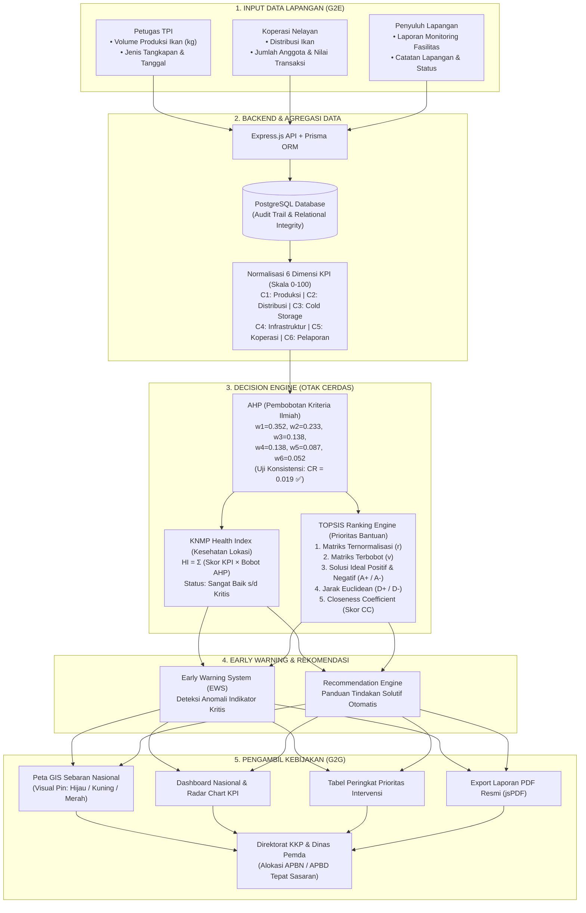

# 🌊 Alur Kerja Sistem & Arsitektur: KNMP-SmartHub
**Government Decision Intelligence Platform for Kampung Nelayan Merah Putih**
*Kategori: E-Government — JOSJIS TEAM (Politeknik Perkapalan Negeri Surabaya)*

---

## 📌 Ringkasan Eksekutif

**KNMP-SmartHub** adalah platform kecerdasan pengambilan keputusan (*Decision Intelligence*) berbasis web yang menghubungkan pemangku kepentingan dari tingkat pesisir/lapangan (*Government-to-Employee / G2E*) hingga tingkat pengambil kebijakan kementerian (*Government-to-Government / G2G*). 

Sistem ini mentransformasi proses monitoring konvensional yang bersifat reaktif dan terfragmentasi menjadi sistem terintegrasi yang **proaktif, objektif, dan berbasis data ilmiah (*data-driven*)** menggunakan metode kombinasi **AHP (Analytic Hierarchy Process)** dan **TOPSIS (Technique for Order Preference by Similarity to Ideal Solution)**.

---

## 🗺️ Diagram Alur Keseluruhan (*End-to-End System Flow*)

---

## 🔄 Rincian 5 Tahapan Alur Kerja Sistem

### 1. Tahap Input Data Lapangan (*Multi-Role Ingestion — G2E*)
Data dikumpulkan secara *real-time* oleh petugas di lapangan melalui modul **Operational Input** yang responsif (*mobile-friendly*):
* **Petugas TPI (Tempat Pelelangan Ikan):** Mencatat log harian hasil tangkapan nelayan (jenis ikan, tanggal, volume dalam kilogram).
* **Koperasi Nelayan:** Mencatat data distribusi hasil laut (kota tujuan, volume) dan indikator ekonomi kelembagaan (anggota aktif, frekuensi transaksi, omzet perputaran dana).
* **Penyuluh Perikanan:** Melaporkan status operasional fasilitas fisik (*cold storage*, pabrik es, SPBN, dermaga) serta menyusun laporan monitoring berkala.
* **Keamanan & Validasi:** Dilengkapi dengan *Role-Based Access Control (RBAC)*, enkripsi JWT, pembatasan lokasi (*location locking*), dan sistem *Audit Trail* permanen.

---

### 2. Tahap Standardisasi & Agregasi KPI
Backend mengolah data mentah transaksional menjadi **6 Indikator Kinerja Utama (KPI)** dengan rentang skala terstandarisasi ($0 - 100$):

| Kode | Dimensi Kinerja | Deskripsi Indikator | Tipe Kriteria |
| :---: | :--- | :--- | :---: |
| **C1** | **Produksi Perikanan** | Volume tonase dan produktivitas hasil tangkapan nelayan | *Benefit* |
| **C2** | **Distribusi** | Efektivitas rantai pasok dan kelancaran penjualan hasil laut | *Benefit* |
| **C3** | **Cold Storage** | Tingkat utilisasi dan keandalan sarana pendingin ikan | *Benefit* |
| **C4** | **Infrastruktur** | Kesiapan fisik dermaga, tambat labuh, TPI, dan SPBN | *Benefit* |
| **C5** | **Koperasi** | Keaktifan kelembagaan dan perputaran ekonomi nelayan | *Benefit* |
| **C6** | **Pelaporan** | Kedisiplinan dan kelengkapan pelaporan data bulanan | *Benefit* |

---

### 3. Tahap Decision Engine (*AHP + TOPSIS Processing*)

Bagian ini merupakan **otak kecerdasan komputasi sistem**:

#### A. AHP (Analytic Hierarchy Process) — Pembobotan Kriteria
Menghilangkan unsur subjektivitas dengan menghitung bobot prioritas kriteria berdasarkan matriks perbandingan berpasangan (*Pairwise Comparison*):
* **Bobot Kriteria ($w$):**
  * $w_1 (\text{Produksi}) = 0.352$
  * $w_2 (\text{Distribusi}) = 0.233$
  * $w_3 (\text{Cold Storage}) = 0.138$
  * $w_4 (\text{Infrastruktur}) = 0.138$
  * $w_5 (\text{Koperasi}) = 0.087$
  * $w_6 (\text{Pelaporan}) = 0.052$
  * **Total Bobot:** $1.000$
* **Uji Konsistensi:** Didapatkan nilai *Consistency Ratio* $CR = 0.019 < 0.10$ *(Valid & Sangat Konsisten)*.

#### B. Health Index — Status Kesehatan Agregat Lokasi
Menghitung skor komposit kesehatan tiap pelabuhan nelayan:
$$\text{Health Index} = \sum_{i=1}^{n} (\text{Skor KPI}_i \times w_i)$$
* **Klasifikasi Status:**
  * $\ge 80$: 🟢 **Sangat Baik**
  * $70 - 79$: 🟢 **Baik**
  * $60 - 69$: 🟡 **Moderat**
  * $50 - 59$: 🟠 **Perlu Perhatian**
  * $< 50$: 🔴 **Kritis**

#### C. TOPSIS (Technique for Order of Preference by Similarity to Ideal Solution)
Meranking prioritas lokasi mana yang paling mendesak membutuhkan intervensi anggaran pemerintah:
1. **Normalisasi Matriks ($r_{ij}$):**
   $$r_{ij} = \frac{x_{ij}}{\sqrt{\sum_{k=1}^{m} x_{kj}^2}}$$
2. **Matriks Ternormalisasi Terbobot ($v_{ij}$):**
   $$v_{ij} = r_{ij} \times w_j$$
3. **Solusi Ideal Positif ($A^+$) dan Negatif ($A^-$):**
   $$A^+ = \{\max(v_{ij})\}, \quad A^- = \{\min(v_{ij})\}$$
4. **Jarak Euclidean ke Solusi Ideal ($D^+$ dan $D^-$):**
   $$D_i^+ = \sqrt{\sum (v_{ij} - A_j^+)^2}, \quad D_i^- = \sqrt{\sum (v_{ij} - A_j^-)^2}$$
5. **Skor Kedekatan Relatif (*Closeness Coefficient* / $CC$):**
   $$CC_i = \frac{D_i^-}{D_i^+ + D_i^-}$$
6. **Penetapan Ranking Intervensi:**
   Diurutkan berdasarkan **Skor $CC$ terkecil (Ascending)**. Lokasi dengan nilai $CC$ mendekati $0$ (paling dekat dengan kondisi terburuk $A^-$) otomatis menempati **Peringkat 1 Prioritas Bantuan Pemerintah**.

---

### 4. Tahap Deteksi Anomali & Rekomendasi (*EWS & Recommendation Engine*)

Sistem tidak hanya menyajikan angka mati, melainkan menghasilkan diagnosa cerdas otomatis:
* **Early Warning System (EWS):** Otomatis menyalakan indikator peringatan ketika satu atau lebih dimensi KPI berada di bawah standar minimum operasi (misal: utilisasi *Cold Storage* $< 40\%$).
* **Recommendation Engine:** Merumuskan narasi rekomendasi aksi spesifik sesuai kendala yang terdeteksi, contohnya:
  > *"Peringatan: Utilisasi Cold Storage rendah (35%). Rekomendasi: Lakukan audit teknis mesin pendingin, sediakan subsidi genset darurat, dan koordinasikan dengan rantai pasok daerah penyangga."*

---

### 5. Tahap Visualisasi & Aksi Pengambil Kebijakan (*G2G*)

Pejabat Direktorat KKP dan Dinas Kelautan Daerah memantau kondisi secara langsung:
1. **Peta GIS Interaktif:** Visualisasi titik pelabuhan nasional dengan penanda warna status (Hijau = Normal, Kuning = Perhatian, Merah = Kritis).
2. **Radar Chart Multi-Dimensi:** Mendiagnosis keseimbangan 6 dimensi kinerja pada pelabuhan tertentu.
3. **Tabel Prioritas Intervensi:** Memberikan justifikasi ilmiah alokasi anggaran APBN/APBD agar tepat sasaran dan efisien.
4. **Export Laporan PDF Resmi:** Mencetak ringkasan eksekutif berstandar dinas dalam satu klik untuk keperluan rapat koordinasi dan pertanggungjawaban program.

---

## 👥 Matriks Hak Akses Pengguna (*Role-Based Matrix*)

| Fitur / Modul | ADMIN | PENGELOLA | TPI | KOPERASI | PENYULUH | PEMDA | KKP PUSAT |
| :--- | :---: | :---: | :---: | :---: | :---: | :---: | :---: |
| **Peta GIS & Dashboard** | ✅ | ✅ | ✅ | ✅ | ✅ | ✅ | ✅ |
| **Input Produksi Ikan** | ✅ | ✅ | ✅ | ❌ | ❌ | ❌ | ❌ |
| **Input Distribusi & Koperasi** | ✅ | ✅ | ❌ | ✅ | ❌ | ❌ | ❌ |
| **Input Laporan Monitoring** | ✅ | ✅ | ❌ | ❌ | ✅ | ❌ | ❌ |
| **Lihat Riwayat Data Sendiri** | ✅ | ✅ | ✅ | ✅ | ✅ | ❌ | ❌ |
| **Eksekusi Rekalkulasi TOPSIS** | ✅ | ❌ | ❌ | ❌ | ❌ | ❌ | ✅ |
| **Export Laporan PDF** | ✅ | ❌ | ❌ | ❌ | ❌ | ✅ | ✅ |
| **Admin Panel (Kelola User/KNMP)** | ✅ | ❌ | ❌ | ❌ | ❌ | ❌ | ❌ |

---

## 💡 Keunggulan & Nilai Tambah Inovasi

1. **Dari Reaktif Menjadi Proaktif:** Mengubah birokrasi yang sebelumnya baru merespons saat program gagal, menjadi mendeteksi anomali sejak dini (*Early Warning*).
2. **Efisiensi Anggaran Negara (ROI Tinggi):** Menghindari bantuan salah sasaran (misal mengirim genset ke lokasi yang masalah utamanya adalah pemasaran).
3. **Objektivitas Ilmiah:** Penentuan lokasi prioritas didasarkan pada perpaduan metode AHP-TOPSIS yang teruji secara matematis dan bebas bias kepentingan.
4. **Kesiapan Implementasi Nyata:** Seluruh fitur telah berfungsi penuh (*production ready*) dengan backend terintegrasi, database relasional PostgreSQL, dan frontend web yang siap diakses dari berbagai perangkat.
